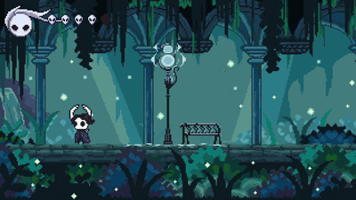
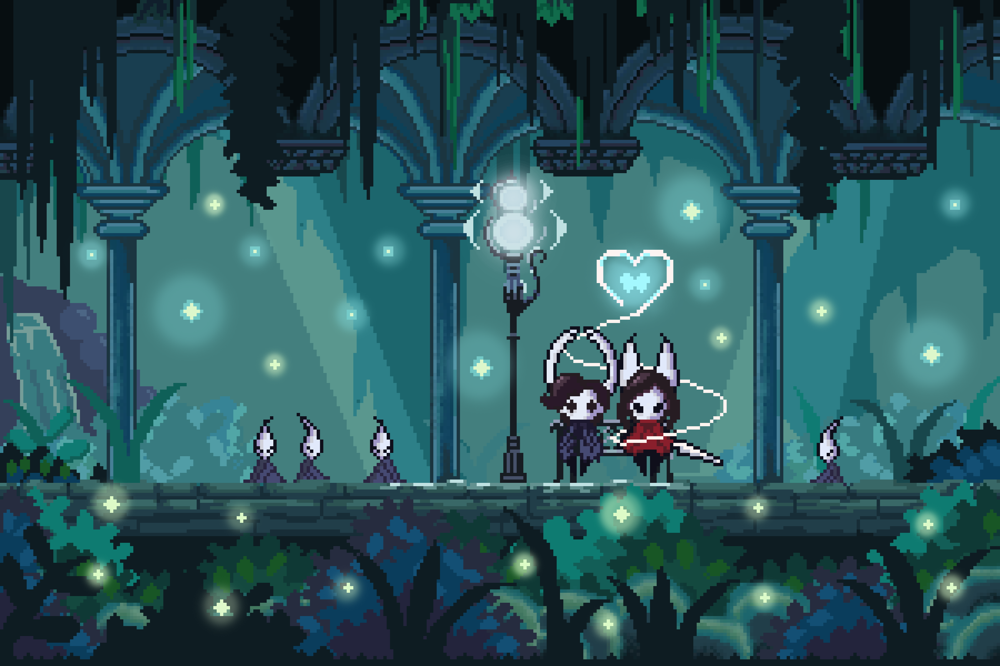
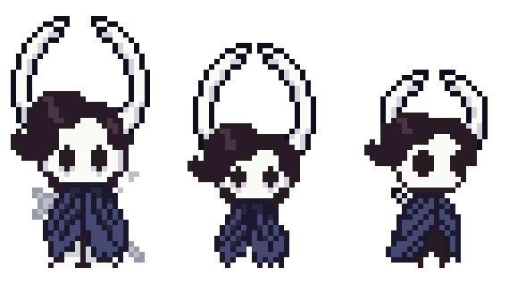
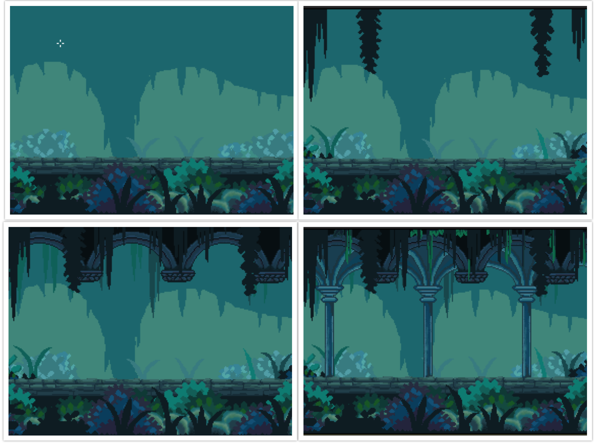

# ⚔️ Pygame Knight (Hollow Knight-Inspired Arena)





## 📖 About the Project

A 2D combat arena platformer built with Python and **Pygame-ce**. Inspired by *Hollow Knight*, this project features fluid movement and combat mechanics, including slashing attacks, pogo-jumping, and directional recoil. Players fight through waves of ground and flying enemies (Crawlid and Gruzzer) with increasing difficulty.

The game includes a complete state management system (Menu, Pause, Victory, Game Over), visual health UI with damage animations, and hit-stop effects for impactful combat.

### ❤️ Origin Story
This project was born from a pixel art illustration I originally created for my partner. I started wondering how I could make the characters in that static image move, and that curiosity led to the creation of this project.



## ✨ Key Features

*   **Fluid Combat:** Implementation of the player's basic moveset (movement, jump, attack, pogo) and directional attacks.
*   **Wave System:** Enemy spawning system with scalable difficulty (Phases and Waves).
*   **Game Feel:** Screen shake, hit-stop (slow motion on impact), and recoil mechanics.
*   **Polished UI:** Visual health system with "broken mask" animations.
*   **Custom Art:** All pixel art assets (characters, enemies, backgrounds) were created 100% by me from scratch using Aseprite.

## 🎨 Creative Process

Since I created all the art assets, here is a look at how the game's visual style evolved.

### Character Design
*Evolution from the first prototype to the final Knight design.*



### Background & Environment
*Process of creating the arena background.*



### Game Evolution

Check out this YouTube video to see the project's evolution—from the early stages using simple red squares to test logic, to the final version featuring hand-drawn pixel art and custom animations.

[](https://youtu.be/2UizuHAcMoA?si=LqtExcCe87xeWq7z)

## 🎮 Controls

| Key | Action |
| :--- | :--- |
| **Arrow Keys** | Move (Left/Right) & Aim Attack (Up/Down) |
| **Space** | Jump |
| **S** | Attack |
| **ESC** | Pause / Back |
| **Enter** | Select / Start |


## 🚀 How to Play

### 🎮 Quick Start for Players (Windows Only)
If you just want to play the game without setting up the code, you can download the latest version for Windows from the **[Releases](https://github.com/Lucrethon/Pygame_Knight/releases)** section. Simply download the `.zip` file, extract it, and run the `.exe`.

---

### 🛠️ Development Setup (Manual Installation)
> **Note:** The following steps must be performed using a **terminal** (Command Prompt/PowerShell on Windows, or Terminal on Linux/macOS).

1.  **Clone the repository:**
    ```bash
    git clone https://github.com/Lucrethon/Pygame_Knight
    cd Pygame_Knight
    ```

2.  **Create a virtual environment (Optional but recommended):**
    ```bash
    # For Windows
    python -m venv venv

    # For Mac/Linux
    venv\Scripts\activate

    #Activate the virtual environment
    source venv/bin/activate
    ```

3.  **Install dependencies:**
    ```bash
    pip install -r requirements.txt
    ```

4.  **Run the game:**
    ```bash
    python main.py
    ```

## 💻 Technologies Used

*   **Language:** Python 3.12
*   **Library:** [pygame-ce](https://pyga.me/) (Community Edition)
*   **Art Tools:** Aseprite

## 📄 License

*   **Code:** Distributed under the MIT License.
*   **Art/Assets:** All graphical assets are licensed under [CC BY-NC-SA 4.0](https://creativecommons.org/licenses/by-nc-sa/4.0/). You may not use them for commercial purposes without permission.
